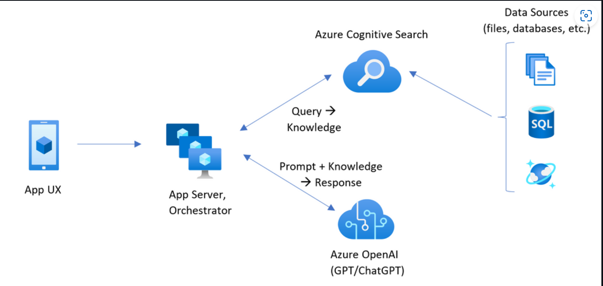

# PartnerCrucible Copilot
This project is based on the following sample: [ChatGPT + Enterprise data with Azure OpenAI and Cognitive Search](https://github.com/Azure-Samples/azure-search-openai-demo)

It looks to surface the insights from the [Partner Crucible](https://aka.ms/PartnerCrucible)

# A few examples

## OpenAI Models

### Prompt

    Create a table listing each of the Azure OpenAI models, with a description, sample uses-cases, and success stories found in the sources below. Use the headings: Model Name, Description, Use-Cases, Success Story. Separate the use-cases using commas ',’. Select success stories from Sogeti, HSBC, Wipro, Soul Machine or other similar examples.

### Response

| Model Name | Description | Use-Cases | Success Story |
| --- | --- | --- | --- |
| GPT-3 | Large, pretrained AI language model for generating and understanding text. | Copywriting, summarization, parsing unstructured text, classification, and translation. | Sogeti used GPT-3 to develop an AI-powered chatbot for a retail client, which was able to understand and respond to customer queries in a natural language. |
| DALL·E | AI model that can generate images from text prompts. | Generating images for e-commerce product catalogs, automating graphic design. | Wipro used DALL·E to create a virtual trial room for a fashion client, enabling customers to see how an outfit would look on them before purchasing. |
| ChatGPT | AI model that can generate and understand conversations. | Creating chatbots, improving customer service. | HSBC used ChatGPT to create a virtual assistant for its website, which was able to answer customer queries in a natural language. |
| Codex | AI model that can generate and understand code. | Automating programming tasks, improving developer productivity. | Soul Machines used Codex to develop an AI-powered assistant for software developers, which was able to write code and provide guidance on programming tasks. |

## Modernization of Web Applications with Microsoft Azure Specialization

### Prompt

    As a partner, I want guidance on attaining the Modernization of Web Applications with Microsoft Azure Specialization. Include a summary of the partner requirement at the top. 
    List the required solution partner designations, Microsoft certifications (with their name, code, and url links to microsoft learn in the format: certification name (XX-NNN): full url.), audit modules for partners to achieve the Modernization of Web Applications with Microsoft Azure Specialization.  

### Response

Partner Requirements: To attain the Modernization of Web Applications with Microsoft Azure Specialization, a partner must have an active Solution Partner designation for Data & AI (Azure) or Digital & App Innovation (Azure).

Solution Partner Designations:
- Data & AI (Azure)
- Digital & App Innovation (Azure)

Microsoft Certifications:
- Microsoft Certified: Azure Solutions Architect Expert (AZ-303): https://docs.microsoft.com/en-us/learn/certifications/azure-solutions-architect/
- Microsoft Certified: Azure DevOps Engineer Expert (AZ-400): https://docs.microsoft.com/en-us/learn/certifications/devops-engineer/
- Microsoft Certified: Azure Developer Associate (AZ-204): https://docs.microsoft.com/en-us/learn/certifications/azure-developer/

Audit Modules:
- Module A: Cloud Foundation
- Module B: Modernization of Web Applications with Microsoft Azure

For more information, refer to the V2.2 Modernization of Web Applications with MSFT Azure Specialization Program Overview, Audit Checklist, FAQ documents. 123

## Devops vs Github

### Prompt

    As a Microsoft partner, I want to provide guidance to customers about the differences between Azure DevOps and GitHub. Prepare a table that explains in which use-cases a team should use Azure Devops, in which case they would use Github, and in which cases they might use both.

### Response

| Use-case | Azure DevOps | GitHub | Both |
| -------- | ------------ | ------ | ---- |
| Cloud-based solution with local data residency | Yes | No | No |
| Need for GitHub Advanced Security and/or Dependabot | No | Yes | No |
| Need for GitHub Codespaces and/or GitHub Discussions | No | Yes | No |
| Planning and tracking | Yes | Yes | Yes (integrated fashion) |

## Incentives

### Prompt

    Prepare a table of Microsoft partner investments and incentives. For column headings use: "Type", "Purpose" "Workloads", "Incentive Structure" "Association". For "Type" include: Enteprise Incentive Program, Microsoft Commercial Incentives, Cloud Solution Provider (CSP) , Online Services Usage, Hosting Incentive Program, Service Provider Licensing Agreement.
    For "Associations" specify PAL or CPOR, or both.

### Response

| Type | Purpose | Workloads | Incentive Structure | Association |
|-------------------------------------|----------------------------------------------------------------------------------------------------------------|-----------------------------------------------------------------------------|---------------------|--------------|
| Enterprise Incentive Program | Rewarding partners for delivering strategic solutions to customers | Azure, Modern Workplace, Business Applications, Data & AI | Tiered rates | PAL |
| Microsoft Commercial Incentives | Rewarding partners for driving the usage and consumption of Microsoft cloud services among customers | Azure, Modern Workplace, Business Applications, Data & AI | Varied rates | CPOR or PAL |
| Cloud Solution Provider (CSP) | Enabling partners to sell Microsoft cloud services directly to customers, manage customer subscriptions and support| Azure, Modern Workplace, Business Applications, Data & AI | Percentage margin | CPOR |
| Online Services Usage | Encouraging partners to drive the usage and consumption of Microsoft Office 365 and Dynamics 365 online services| Office 365, Dynamics 365 | Rebates | CPOR or PAL |
| Hosting Incentive Program | Encouraging partners to host Microsoft software for their customers | Microsoft software hosted by partners | Discounts | PAL |
| Service Provider Licensing Agreement | Enabling partners to license and host Microsoft products and services for their customers | Microsoft products and services hosted by partners | Discounts | PAL |

## Training

### Prompt

    Prepare a table of training sessions for the security architect. for column headings use: "Certification name", "Certification code", "session type", "External Registration Link". For session type, include "Virtual Training Days", "ESI", and other session types.

### Response

| Certification name | Certification code | Session type | External Registration Link |
|----------------------------------------|--------------------|--------------------|--------------------------------------------------------------------|
| Azure Security Engineer Associate | AZ-500 | ESI | https://partner.microsoft.com/en-gb/training/assets |
| M365 Security Administrator Associate | MS-500 | ESI | https://partner.microsoft.com/en-gb/training/assets |
| Security Operations Analyst Associate | SC-200 | ESI | https://partner.microsoft.com/en-gb/training/assets |
| Identity and Access Administrator Associate | SC-300 | ESI | https://partner.microsoft.com/en-gb/training/assets |
| Information Protection Administrator Associate | SC-400 | ESI | https://partner.microsoft.com/en-gb/training/assets |
| Cybersecurity Architect Expert | SC-100 | ESI | https://partner.microsoft.com/en-gb/training/assets |
| Azure Security Engineer Associate | AZ-500 | Virtual Training Days | https://www.microsoft.com/en-gb/training-days/security/defend-against-threats-and-secure-cloud/ |
| Security through the lens of Zero Trust | NA | Virtual Training Days | https://www.microsoft.com/en-gb/training-days/security/zero-trust |
| Microsoft Defender External Attack Surface Management | NA | Partner Webinar | https://partner.microsoft.com/en-gb/training/assets |

## Work in progress

### Prompt

    Prepare a table of how Microsoft supports partners for each solution area. For support, include: FY23 microsoft partner taxonomy sales plays, solution partner designation, required certifications,  specializations, a description of related incentives or rewards, partner association. 
    For Solution Areas includes: Azure Infrastructure, Security, Modern Work, Business Apps, Data and AI, Digital and App Innovation, and Industry Cloud. 
    Do not reference Silver or Gold competencies. Only refer to the solution partner designations.
    When listing certifications, also include the url on Microsoft learn.
    Seperate partner sales plays with ','. 
    For partner associations, specify PAL or CPOR.

### Response

| Solution Area | FY23 Microsoft Partner Taxonomy Sales Plays | Solution Partner Designation | Required Certifications | Specializations | Related Incentives/Rewards | Partner Association |
| --- | --- | --- | --- | --- | --- | --- |
| Azure Infrastructure | Azure Migration, Azure Hybrid, Azure Innovation | Azure Advanced Specialization | Azure Administrator Associate, Azure Solutions Architect Expert | Azure Expert MSP | Azure breadth motion incentive, Azure enterprise and self-service incentive | PAL |
| Security | Security and Compliance, Zero Trust, Identity and Access Management | Security Advanced Specialization | Microsoft Security Operations Analyst Associate, Microsoft Identity and Access Administrator Associate | Microsoft Security 20/20 Partner of the Year, Microsoft Intelligent Security Association, Microsoft Security Elite Partner | Security depth motion incentive, Security enterprise and self-service incentive | CPOR |
| Modern Work | Teams and Meetings, Endpoint Management, Security and Compliance | Modern Work Advanced Specialization | Microsoft 365 Certified: Teams Administrator Associate, Microsoft 365 Certified: Security Administrator Associate | Microsoft Intelligent Communications Partner of the Year | Modern Work depth motion incentive, Modern Work enterprise and self-service incentive | PAL |
| Business Apps | Dynamics 365 Sales, Dynamics 365 Finance and Operations, Power Platform | Business Applications Advanced Specialization | Microsoft Certified: Dynamics 365 Fundamentals, Microsoft Certified: Dynamics 365 Sales Functional Consultant Associate, Microsoft Certified: Dynamics 365 Finance Functional Consultant Associate | Microsoft Dynamics 365 Partner of the Year, Microsoft Power Apps Partner of the Year | Business Applications depth motion incentive, Business Applications enterprise and self-service incentive | CPOR |
| Digital and App Innovation | Cloud-Native App Development, Internet of Things, Data and Analytics | App Innovation Advanced Specialization | Microsoft Certified: Azure Developer Associate, Microsoft Certified: Azure Data Scientist Associate | None specified | App Innovation depth motion incentive, App Innovation enterprise and self-service incentive | PAL |
| Industry Cloud | Financial Services, Healthcare, Manufacturing | Industry Advanced Specialization | None specified | None specified | Industry depth motion incentive, Industry enterprise and self-service incentive | CPOR |

## Work in progress

    Prepare a table of how Microsoft supports partners. For column headings use: "Commercial Marketplace", "Financial incentives". For partner types, use "ISV Partners" and "Services Partners"
    

| | Commercial Marketplace | Financial incentives |
|--------------|-----------------------|----------------------|
| ISV Partners | Expand customer connections through the Microsoft commercial marketplace, tools and platforms, guidance from business leaders, and technical experts. Join the ISV Success Program, the pathway for ISVs within the Microsoft Cloud Partner Program 12 | Flat agency fees of 3%, motivate partners in the Cloud Solution Provider (CSP) program to sell an ISV’s offer with margin sharing, and unlock enterprise customers with enhancements in private offers for customized deals. 1 |
| Services Partners | Path within the Solutions Partner for Modern Work and for Business Applications. 1 | Flat agency fees of 3%, motivate partners in the Cloud Solution Provider (CSP) program to sell an ISV’s offer with margin sharing, and unlock enterprise customers with enhancements in private offers for customized deals. 1 |

